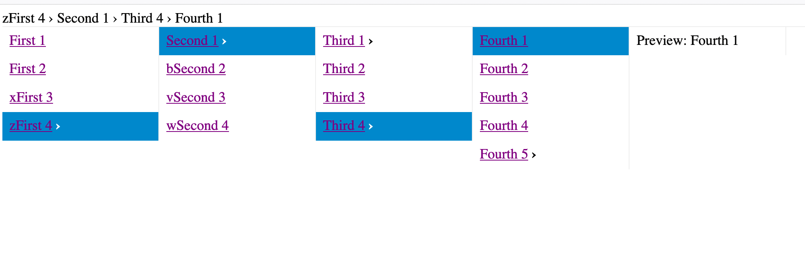

# miller-columns

ES6 Modules adaptation and expansion of
<http://jsfiddle.net/yckart/cbtnemc7/>

## Screenshots



## Features

- Works with semantically correct `<ul>` (or `<ol>`) lists
- Well-namespaced CSS classes and `data-*` attributes ("miller-" by default).
- Using up/down/right/left arrows for navigation
- Using escape key for resetting to beginning
- Auto-selection of first item if none chosen
- Click listeners for navigation
- Ability to register callback to be triggered with current selection
    (or upon reset)
- Default ability to display breadcrumbs (overridable)
- Default ability for animation (or overridable), including setting the delay
- Default ability to reset the column browser when clicking within the browser
    area but not on a column
- Available stylesheet for basic styling

## Installation

`npm install miller-columns --save`

## Set-up

### ES6 Module-supporting browsers

```html
<!-- See comment in JavaScript example on current need for this here-->
<script src="node_modules/jquery/dist/jquery.js"></script>
<!-- Let your main.js do the imports as in the example below -->
<script type="module" src="main.js"></script>
```

### Older browsers

```html
<script src="node_modules/jquery/dist/jquery.js"></script>
<script src="node_modules/miller-columns/dist/index-umd.js"></script>
<script src="main.js"></script>
```

## Expected HTML data format

In order to take advantage of the default stylesheet, you should:

1. Put the class `miller-columns` on the element on which you will invoke
    our jQuery plug-in for adding Miller columns. The nestable `<ul>` or
    `<ol>` lists you create (with `<li>` children) will be automatically
    given the `miller-column` and possibly the `miller-collapse` class
    and its `<li>` any of these classes: `miller-parent` or `miller-selected`.
    If you do not wish one of the lists within `miller-columns` to be
    treated as part of the Miller columns, give it a `miller-no-selected`
    class.
1. Add `miller-breadcrumbs` for whichever element you want to be the
    container for breadcrumbs. Those individual breadcrumbs will be given
    the `miller-breadcrumb` class and will be added automatically.

Note that `miller-breadcrumbs` is the only class expected to be present by
our JavaScript code, and that is only if you are not overriding the
`breadcrumbs` option, and also if you have not changed the default
`namespace` to something other than "miller".

(Also as far as namespacing, the library uses jQuery's `.data()` with
`miller-ancestor` and `miller-child` (which can also be altered by the
`namespace` option), but these are stored internally by jQuery).)

## Example (ES6)

```js
// Though on Roadmap for 3.4.0 (see https://github.com/jquery/jquery/wiki/Roadmap),
//  jQuery doesn't have ES6 either as source or in a distribution, so you
//  currently have to use Rollup with CommonJS plugins to get this next line
//  working (or just add the script non-modularly to HTML and use the global `$`)
import $ from 'jquery';

import addMillerColumnPlugin from './node_modules/miller-columns/dist/index-es.min.js';

(async () => {
// The second options argument is optional
await addMillerColumnPlugin($, {stylesheets: ['path/to/extra-stylesheet.css', '@default']});

$('div.miller-columns').millerColumns({
  // Options:
  current ($item, $cols) {
    console.log('User selected:', $item);
  }
});
})();
```

## Constructor

Returns a promise resolving when all supplied stylesheets (if any) have
been loaded.

- `$` - The instance of jQuery to which you are adding the plug-in.
- `options`
    - `stylesheets` - An optional array of stylesheet paths to be loaded in
        parallel. Is meant for this plug-in, but you could include any
        stylesheets to benefit from them loading together in parallel. Using
        `@default` will provide (an attempt to) load the default stylesheet.
        Due to current browser limitations, we can only guess the location of
        our module URL.
    - `namespace` - Defaults to `miller`. The default must be kept if one
        wishes to use the provided `miller-columns.css` stylesheet without
        modification.

## Plugin options

- `animation` - Optional callback for ensuring the viewport shows the
    entire newly expanded item. Defaults to an internal method. Passed the
    column item and columns jQuery objects as arguments.
- `breadcrumb` - Optional callback for adding the breadcrumb path using the
    chain of selected items. Defaults to an internal method. No arguments.
- `current` - Optional callback; defaults to a noop. Called upon selection.
    Passed the column item and columns jQuery object as arguments.
- `reset` - Optional callback; defaults to a noop. Called upon reset (by
    user hitting escape key or any time clicking an element). Passed the
    columns jQuery object as argument
- `preview` - Optional callback; defaults to `null`. Passed the column
    item and columns jQuery object as arguments. The return result should be
    an HTML string which is used to fill the list item which functions as the
    preview pane when selected a final item (an item without children).
- `delay` - Optional integer indicating animation delay. Defaults to 500ms.
- `resetOnOutsideClick` - Optional boolean to indicate whether to reset the
    browser to the beginning upon clicking within the columns area where
    it is not a column. Defaults to `true`.

## To-dos

1. Stop jolting when switching between those with preview panes at same
    level and which are already scrolled (new `scrollIntoView` code?)
1. Any way to avoid restructuring of DOM for sake of accessibility?
1. Support JSON (as with routine for converting internally to HTML)
    1. Parse lazily from JSON (or HTML) data sources (using ES6 generator)
1. Allow for Preview column for `<ul>`/`<ol>`
1. Support `<dl>` parsing with `<dt>` as text that shows and `<dd>` as
    meta-data to show in where the Mac Finder would show its preview area
1. Editing
    1. Option to create
    1. Option to delete
    1. Option to rename (and trigger event) by clicking into cell
    1. Option to move (by drag and drop and cut-paste key commands)
1. Adapt from <https://bitbucket.org/brettz9/colbrowser>?
